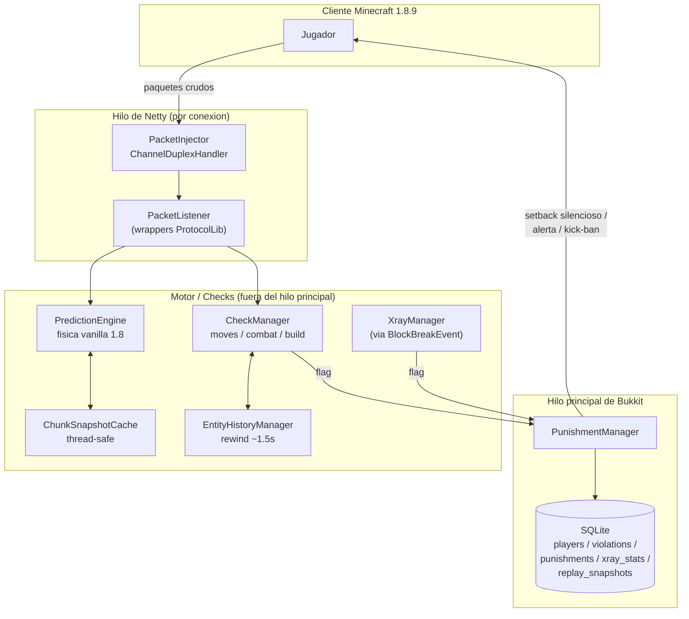
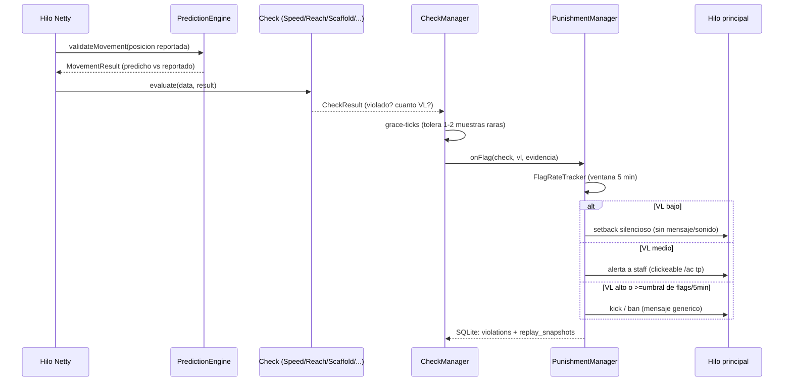

# Blackhole

Anticheat de movimiento, combate, construcción y xray para **Spigot/Paper 1.8.8 / 1.8.9**, con motor de física propio (simulación real de la física vanilla, no heurísticas sueltas), inyección híbrida Netty + ProtocolLib, rewind de entidades para compensación de lag, y persistencia en SQLite.

> Sin BuildTools, sin NMS crudo compilado. La inyección de paquetes usa reflexión genérica (por tipo, no por nombre de campo obfuscado) para llegar al `Channel` de Netty, y ProtocolLib para parsear el contenido de los paquetes ya interceptados.

## Arquitectura



## Pipeline de un flag



## Que implementa

| Fase | Modulo | Detalle |
|---|---|---|
| 1 | **Motor de fisica** | Gravedad, friccion por bloque (data-driven, `BlockPhysicsProfile`), sprint-jump, agua/lava, telarana, soul sand, escaleras/vides, slime blocks. AABB del jugador con step-height de 0.5. |
| 2 | **Paquetes + movimiento** | Inyeccion Netty+ProtocolLib, cache de chunks thread-safe (`ChunkSnapshot` de Bukkit), `Speed`/`Fly`/`Jesus`/`Spider` interpretando el `MovementResult` del motor (no reglas propias). |
| 3 | **Combate + rewind** | `Reach`, `KillAura` (angulo + swing + raycast a traves de pared + multi-aura), `Aimbot` (GCD + deteccion de snap), `AutoClicker` (varianza de intervalos, no CPS fijo), `AntiKnockback` (formula real de KB 1.8). Todo contra la posicion **rebobinada** de la victima. |
| 4 | **Construccion** | `Scaffold` (linea recta + pitch hacia abajo + timing uniforme), `Tower` (bridging vertical), `NoSlow` (reutiliza el `MovementResult` ya que el motor penaliza velocidad al usar item). |
| 5 | **Xray** | Independiente (via `BlockBreakEvent`, no paquetes): blind ore reveal, ratio menas/bloques vs. promedio del server, tracking de tuneles rectos hacia vetas. |
| 6 | **Castigos + SQLite** | Setback silencioso / alerta a staff / kick-ban por check, mas `FlagRateTracker` (failsafe de volumen, ban automatico). 5 tablas, DAOs 100% async. |
| 7 | **Comandos / config** | `/ac reload\|alerts\|vl\|exempt\|tp\|history`, toggle por check y de alertas en `config.yml`. |

## Requisitos

- Java 8+ para compilar (`maven.compiler.source/target = 1.8`)
- Maven
- Servidor **Spigot/Paper 1.8.8 o 1.8.9**
- **ProtocolLib** instalado en el servidor (soporta 1.8 hasta la ultima version, `ProtocolLibrary.MINIMUM_MINECRAFT_VERSION = 1.8`)

## Compilar

```bash
mvn clean package
```

Genera `target/blackhole-1.0-SNAPSHOT.jar` (shadeado, SQLite relocalizado a `com.blackhole.libs.sqlite` para no chocar con otros plugins).

## Instalar

1. Poner `ProtocolLib.jar` en `plugins/` del servidor (si no esta ya).
2. Copiar `blackhole-1.0-SNAPSHOT.jar` a `plugins/`.
3. Iniciar el servidor. Se genera `plugins/Blackhole/config.yml` y `plugins/Blackhole/anticheat.db`.

## Configuracion

`config.yml` expone, por check individual: `enabled`, `alert-vl`, `punish-vl`, `punish-command` (con `{player}` como placeholder). Ademas:

```yaml
punishments:
  flag-rate:
    threshold: 18              # flags combinados en 5 min -> ban automatico
    ban-duration-seconds: 86400
alerts:
  broadcast-enabled: true
  console-log-enabled: true
```

## Comandos y permisos

| Comando | Permiso | Descripcion |
|---|---|---|
| `/ac reload` | `anticheat.admin` | Recarga `config.yml` y reaplica toggles |
| `/ac alerts` | `anticheat.alerts` | Toggle de recibir alertas |
| `/ac vl <jugador>` | `anticheat.admin` | VL actual por check |
| `/ac exempt <jugador> <segundos>` | `anticheat.admin` | Exime de todos los checks temporalmente |
| `/ac tp <jugador>` | `anticheat.admin` | Teletransporte en modo espectador (usado tambien por el boton de las alertas) |
| `/ac history <jugador>` | `anticheat.admin` | Ultimas violaciones registradas en SQLite |

Permisos: `anticheat.admin` (default `op`), `anticheat.alerts` (default `op`), `anticheat.bypass` (default `false`).

## Estructura del proyecto

```
com.blackhole
├── BlackholePlugin.java       bootstrap
├── data/                       PlayerData, historial de entidades, snapshots
├── physics/                    PredictionEngine, BlockPhysicsProfile, AABB
├── packet/                     Inyeccion Netty + dispatch de ProtocolLib
├── check/
│   ├── moves/                  Speed, Fly, Jesus, Spider, NoFall
│   ├── combat/                 Reach, KillAura, Aimbot, AutoClicker, AntiKnockback
│   └── build/                  Scaffold, Tower, NoSlow
├── xray/                       ExplorationTracker, OreReveal, VeinTracking
├── punishment/                 PunishmentManager, FlagRateTracker
├── storage/                    Database + DAOs (SQLite, async)
└── command/                    /ac
```

## Limitaciones conocidas (pendientes de validar en un servidor real)

- Los **indices de campo** que se leen via `PacketContainer` (x/y/z, yaw/pitch, onGround, BlockPosition en `BlockPlace`) siguen la convencion documentada de ProtocolLib, pero no se probaron contra un servidor 1.8.9 en vivo.
- El **sampling de entidades** para el rewind corre cada tick vía `getNearbyEntities` por jugador; con 200 jugadores concurrentes puede necesitar un intervalo mayor o una estructura espacial mas eficiente.
- El **hitbox de bloques no-cubicos** (escaleras, losas, vallas) se aproxima como bloque solido completo — pendiente para una fase posterior.
- La **formula de knockback** es una reconstruccion fiel de la vanilla 1.8 pero no bit-exact verificada en vivo.

## Stack

Java 8 · Maven · Spigot API 1.8.8-R0.1 · ProtocolLib 5.3.0 · Netty 4.0.23.Final · SQLite (xerial) + maven-shade-plugin
